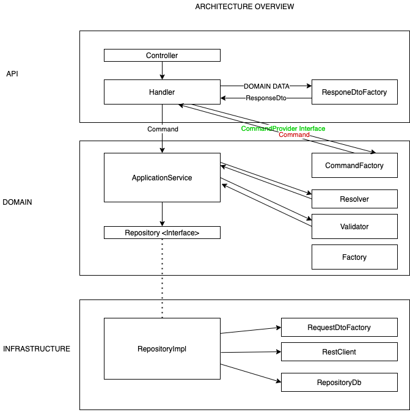

<h3><b>Title</b> : Project modules convention</h3>
<b>Date</b> : 06.04.2021 
<b>Author</b> : Maciej Lumanisha 
<b>Description</b> : 

<h4>Modules convention:</h4>

* <b>[api-web]:</b>
    - responsible for regular user front-end interaction
    - depends on <u>domain</u> and <u>api-shared</u> modules
    - security should be based on ROLES
    - functionalities should be available under /web/api/application-name/
* <b>[api-mobile]:</b>
    - responsible for mobile user interaction
    - depends on <u>domain</u> and <u>api-shared</u> modules
    - security should be based on ROLES
    - functionalities should be available under /mobile/api/application-name/
* <b>[api-admin]:</b>
    - responsible for admin/super-user interaction
    - depends on <u>domain</u> and <u>api-shared</u> modules
    - security should be based on ROLES
    - functionalities should be available under /admin/api/application-name/
* <b>[api-security]:</b>
    - responsible for security filters, authentication 
    - depends on <u>domain</u> and <u>api-shared</u> modules
    - functionalities should be available under /auth/api/application-name/
* <b>[api-service]:</b>
    - responsible for interaction with other services (machine to machine communication)
    - depends on <u>domain</u> and <u>api-shared</u> modules
    - security should be based on ROLES
    - can contain Kafka event listeners
    - functionalities should be available under /service/api/application-name/
* <b>[api-shared]:</b>
    - should contain classes reused in other api-modules such as: mappers, validators, request dto
    - should not contain controllers
    - depends on <u>domain</u> module
* <b>[domain]:</b>
    - contains business logic
    - does not depend on other modules
* <b>[infrastructure]:</b>
    - contains a code responsible for interaction with external services, databases, etc.
    - depends on <u>domain</u> module
* <b>[application]:</b>
    - builds and runs entire application

[Link to architecture drawi.io project file](misc/architecture.drawio) 

