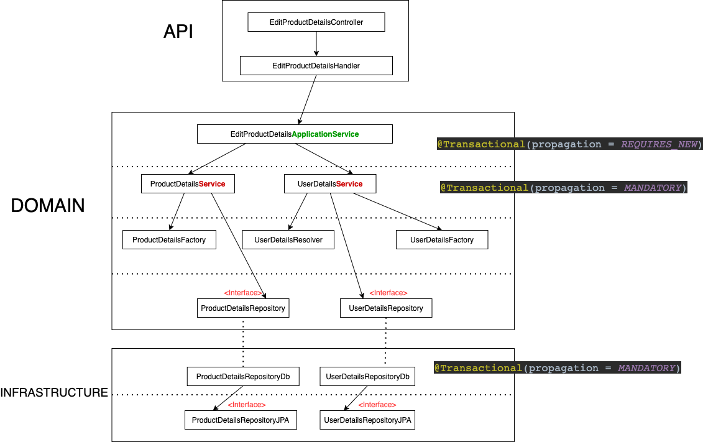

<h3><b>Title</b> : Transaction policy</h3>
<b>Date</b> : 06.04.2021<br>
<b>Author</b> : Maciej Lumanisha<br>
<b>Description</b> :<br>

1. All transactions must start in domain layer in ApplicationService. That's why ApplicationService transaction
   propagation should be REQUIRES_NEW<br>
   <b>@Transaction( propagation = REQUIRES_NEW)</b> means that spring will create new transaction (each time and no
   matter what)!!!
2. Infrastructure repositories and simple domain Services should have @Transaction(propagation = MANDATORY)<br>
   <b>@Transaction( propagation = MANDATORY)</b> means that Spring requires an existing physical transaction or will
   cause an exception !!!
   This forces us to create transactions in domain layer.

[Link to diagram drawi.io project file](misc/transactions_diagram.drawio)<br>


Domain service:

```java
@Service
@RequiredArgsConstructor
public class UserApplicationService {
	
	private final UserRepository userRepository;
	
	@Transactional(propagation = REQUIRES_NEW)
	public List<User> findAll() {
		return userRepository.findAll();
	}
}
```

Domain Repository interface:

```java
public interface UserRepository {
	
	List<User> findAll();

}
```

Infrastructure repository:

```java
@Service
@RequiredArgsConstructor(access = PACKAGE)
class UserRepositoryDb implements UserRepository {
	
	private final UserRepositoryJPA repositoryJpa;
	private final UserFactory userFactory;
	
	@Override
	@Transactional(propagation = MANDATORY)
	public List<User> findAll() {
		return repositoryJpa.findAll().map(userFactory::create);
	}
}
```
